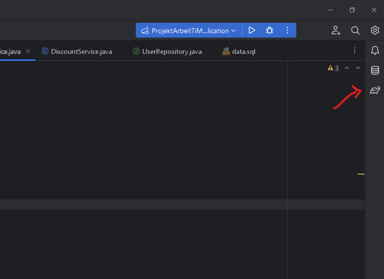
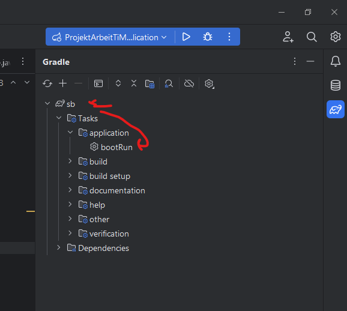

# Documentation

[TOC]

## Description

Dieses Projekt geht es darum, ein RESTAPI Applikation zu erstellen. Es wurde mit Springboot erstellt und als das Projektarbeit für üK 295: Backend Dev.

## Prerequisite

Es wird diese Software benutzt, um das Programm zu **laufen** lassen:

- Docker [Download Link](https://docs.docker.com/get-docker/)
- Intellij [Download Link](https://www.jetbrains.com/idea/)
- Postman [Download Link](https://www.postman.com/downloads/)

## Installation

Um das Programm laufen zu lassen, muss man zuerst das Repo Clone

```bash
git clone https://github.com/Timofey-Makhankov/ueK_295TiMak_Projekt_Arbeit.git
```

Man startet Docker auf und lauft dieses Befehl, um ein Postgres Docker Container erstellen und laufen lassen:

```bash
docker run -d -p 5432:5432 -e POSTGRES_PASSWORD=postgres --name uek295db postgres
```

- Name: uek295db
- POSTGRES_PASSWORD: postgres
- port: 5432

Um zu nachschauen, ob das Docker Container lauft, kann man mit diesem Befehl es nachschauen:

```bash
docker ps
```

Man kann es auch mit Docker Desktop GUI nachschauen

Im Intellij sollte man nur auf den Grünen lauf zeichen anclicken, wenn das der Fall nicht ist kann man vom Gradle Tab, unter applikationen und `bootRun` klicken.




Die Documentation zu Endpoints kann man nach starten vom Programm mit diesem Link ansehen:

http://localhost:8080/swagger-ui/index.html oder [hier](http://localhost:8080/swagger-ui/index.html) anklicken

**Die Datenbank muss auch laufen, um die Applikation zu starten**

Unter Postman Ordner kann man die Postman Tests in JSON 2.1 Format zu finden. Diese Datei kann man in Postman importieren. **Diese Tests soll man nur von Starten des Applikationen laufen lassen**
